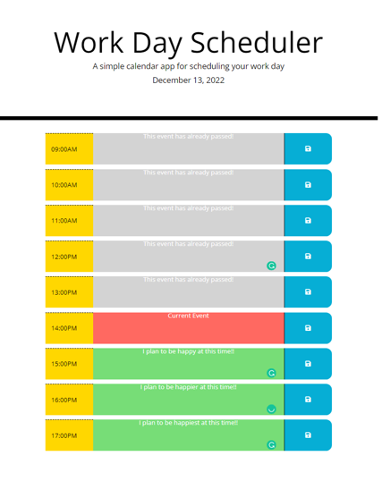

# planner-application
This is a planner which has current dates  on which users can log their itinerary easily and edit them if need be.

The entire page is designed using BootStrap while the logic uses JQuery. The page grid is designed to remain consistent
for all viewports. 

The planner displays the current date at the top of page, and is set between 09:00am and 05:00pm. The user simply needs to
click in schedule sections (at center) to edit schedule corresponding to adjacent time. The schedule is set to dynamically align with one of
3 different periods:

 * the past which are times behind the current time. Schedule here cannot be edited and is populated with text "".
 * the present, which is the current time. Text of schedule here is set to "Current event".
 * the future, which are times ahead of current time. Schedule here can be edited as seen fit.
 
 A screenshot of the page is shown below:
 
 
 
 
 

